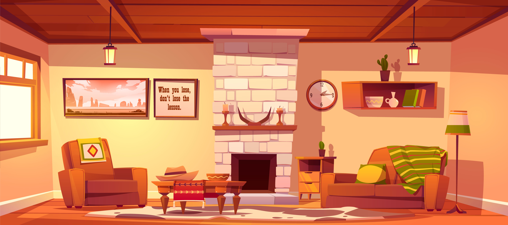

# CAHIER DES CHARGES - Les boules de P'luches

## Arborescence
- Home : "\salon" => Salon
- Partenaires : "\partenaires" => Cuisine
- Santé : "\sante" => Bibliothèque
- Nos missions : "\missions" => Garage
- Nos membres : "\membres" => Livre ouvert de tous les chats
- Détails : "\details" => Livre ouvert, page détail d'un chat

## SALON

Liste des composants : 
- Composant fond
- Chat membre => Au clic on ouvre le détail du chat

## CUISINE

Liste des composants : 
- Composant fond
- Chat membre => Au clic on ouvre le détail du chat
- Sac de croquettes => Au clic on ouvre le détail des croquettes partenaires
- Jouets => Au clic on ouvre le détail des boutiques partenaires
- Thon => Au clic, on ouvre un petit jeu sur nos partenaires

## BIBLIOTHEQUE

Liste des composants : 
- Composant fond
- Chat membre => Au clic on ouvre le détail du chat
- Livres => Astuces santé, Tous sur les vaccins, la puce etc.
- Livres => Le saviez vous, sur les chats. (Lois, comportements, etc)

## GARAGE

Liste des composants : 
- Composant fond
- Chat membre => Au clic on ouvre le détail du chat
- Voiture au nom de la marque => Qui sommes nous. (type h citroen)
- Cage à chat => Récupérer, secourir. 
- Valise pharmacie => Soigner, protéger
- Photo de famille => Placer dans un foyer aimant